<h1 align="center">
  Olá!
   
  Eu sou Silas Kaleby Alexandre Sobrinho
</h1>

  💻 Desenvolvedor Full Stack  
  📍 Caucaia, Ceará, Brasil

  

---

## 👨‍💻 Sobre Mim

Sou estudante do primeiro semestre de Engenharia de Software e tenho grande interesse em resolver desafios através da tecnologia. Gosto de pegar problemas complexos e transformá-los em soluções práticas e funcionais usando programação.

Atualmente, estou focado no desenvolvimento backend com Python, explorando áreas como automação, análise de dados e machine learning. Busco constantemente evoluir minhas habilidades, criando projetos que não só reforçam meu aprendizado, mas também têm potencial para gerar impacto no mundo real.

Atualmente, desenvolvo projetos práticos utilizando:

- **Git e GitHub** para versionamento e organização de código  
- **Python** para desenvolvimento backend, automação e prática de lógica de programação  
- **C** para fortalecimento da base em programação e entendimento de baixo nível  
- **JavaScript** para interatividade e desenvolvimento de aplicações web  
- **HTML e CSS** para criação de interfaces e páginas web  
- **Lógica de programação** aplicada na resolução de problemas  
- **Arquitetura em nuvem** (conceitos iniciais e fundamentos)  

Estou em busca de uma *oportunidade de Junior em Desenvolvimento de Software*, onde eu possa colaborar com times reais, aprender com profissionais experientes e contribuir com soluções bem estruturadas e de qualidade.

---

## 🛠️ Tech Stack

### Linguagens

   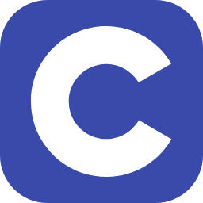
  
  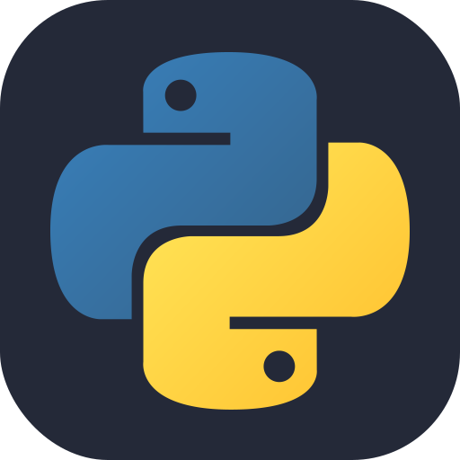
  
  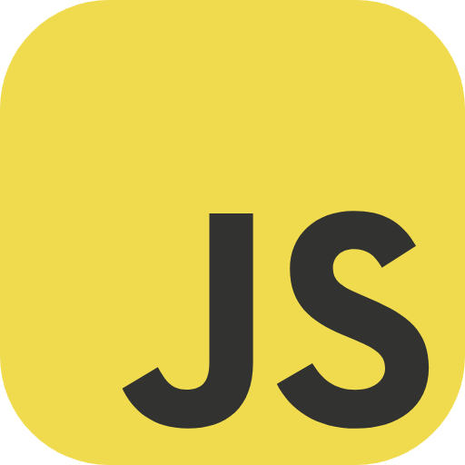
  
  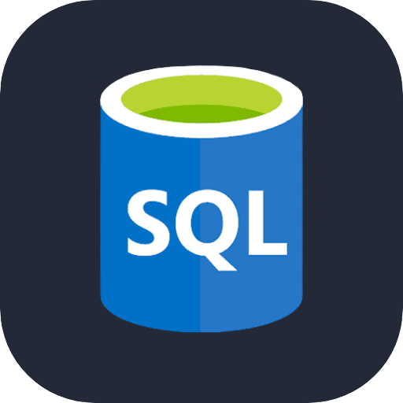

### Frameworks & Bibliotecas

  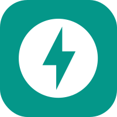
  
  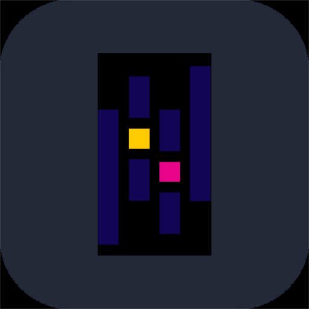
  
  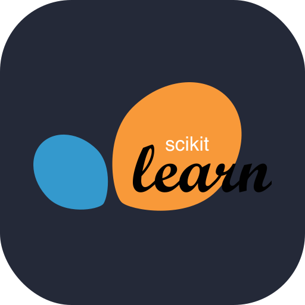
  
  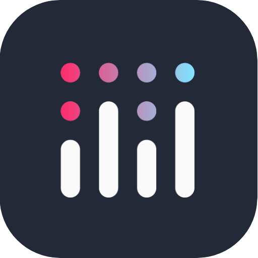

### Banco de Dados

  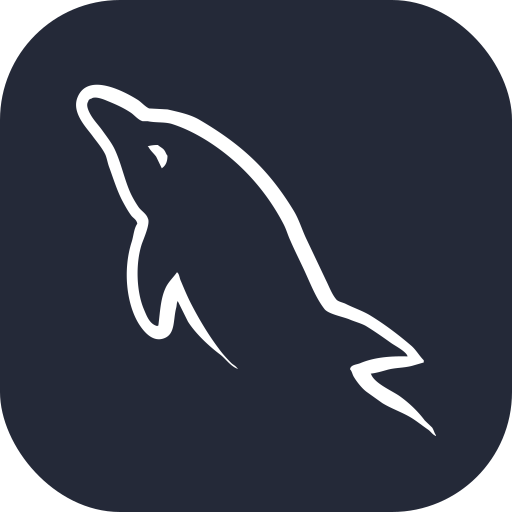
  
  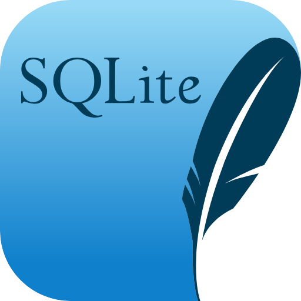

### Versionamento & Deploy

  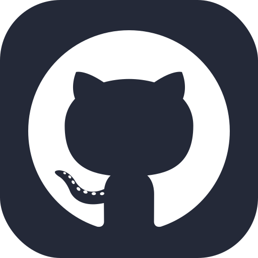
  
  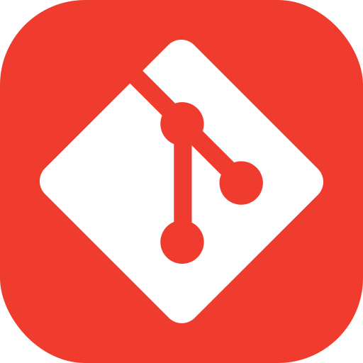
  
  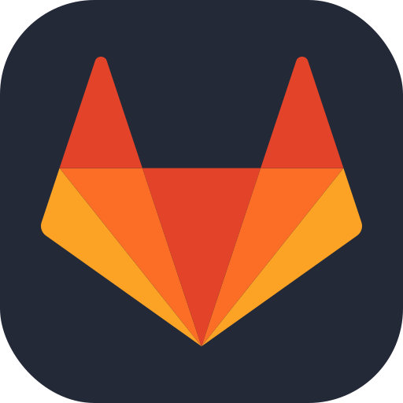
  
  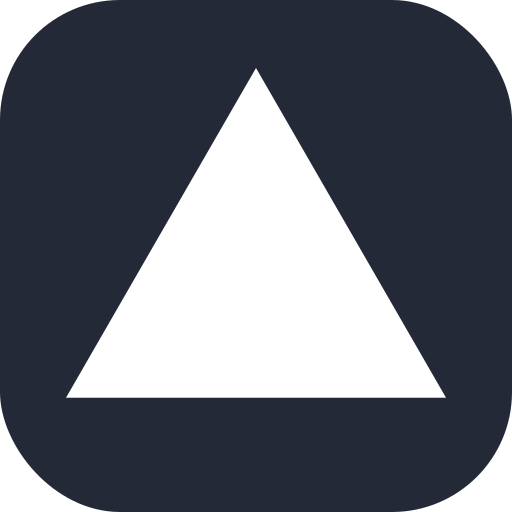

     

