<h1 align="center">
  Olá!
  
  Eu sou Silas Kaleby Alexandre Sobrinho
</h1>

  💻 Desenvolvedor Full Stack 
  📍 Caucaia, Ceará, Brasil

  

---

## 👨‍💻 Sobre mim

Sou estudante do primeiro semestre de Engenharia de Software e tenho grande interesse em resolver desafios por meio da tecnologia. Gosto de transformar problemas complexos em soluções práticas e funcionais utilizando programação.

Meu foco atual está no desenvolvimento backend com Python. Também estou explorando áreas como automação, análise de dados e machine learning.

Busco constantemente evoluir minhas habilidades por meio da criação de projetos que reforçam meu aprendizado e que também possam gerar impacto no mundo real.

Desenvolvo projetos práticos utilizando:

- **Git e GitHub** para versionamento e organização de código;
- **Python** para desenvolvimento backend, automação e prática de lógica de programação;
- **C** para fortalecer minha base em programação e compreender conceitos de baixo nível;
- **JavaScript** para interatividade e desenvolvimento de aplicações web;
- **HTML e CSS** para criação de páginas e interfaces web;
- **Lógica de programação** aplicada à resolução de problemas;
- **Arquitetura em nuvem**, estudando seus conceitos e fundamentos iniciais.

Estou em busca de uma **oportunidade como desenvolvedor de software júnior**, na qual eu possa colaborar com equipes, aprender com profissionais experientes e contribuir para o desenvolvimento de soluções bem estruturadas e de qualidade.

---

## 🛠️ Tecnologias

### Linguagens

  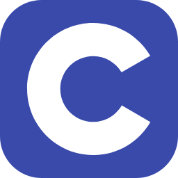
  &nbsp;&nbsp;
  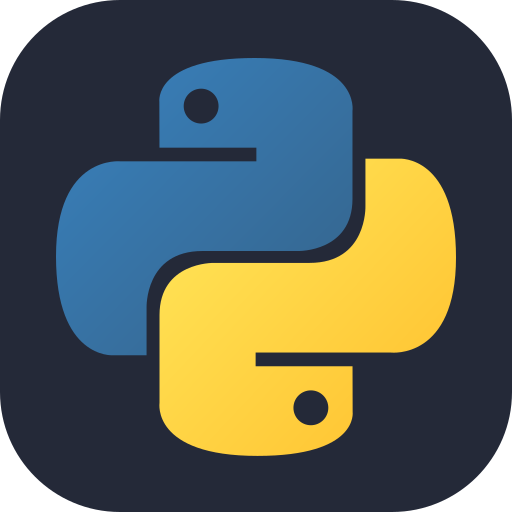
  &nbsp;&nbsp;
  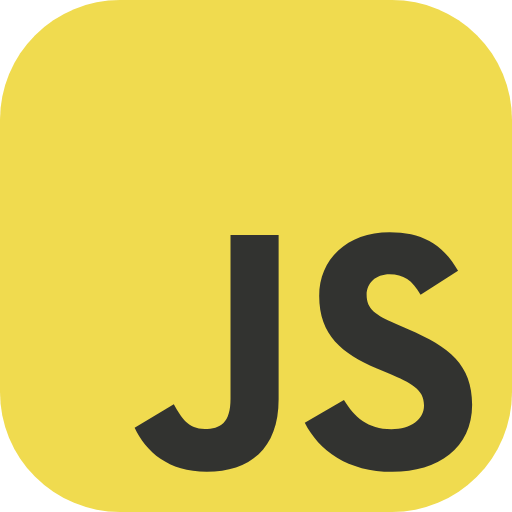
  &nbsp;&nbsp;
  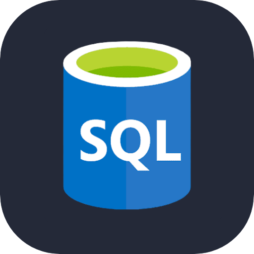

### Frameworks e bibliotecas

  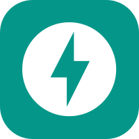
  &nbsp;&nbsp;
  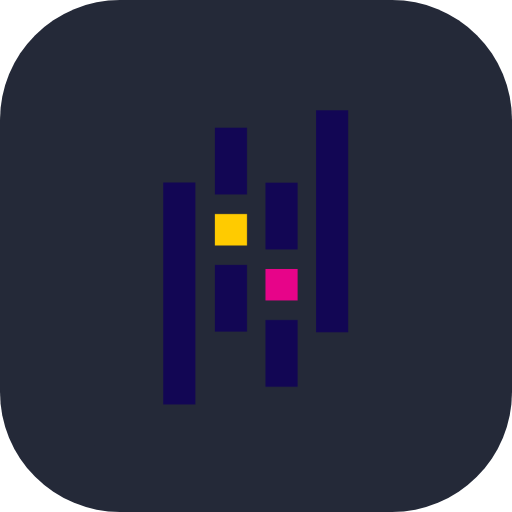
  &nbsp;&nbsp;
  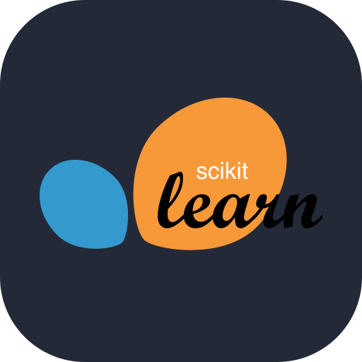
  &nbsp;&nbsp;
  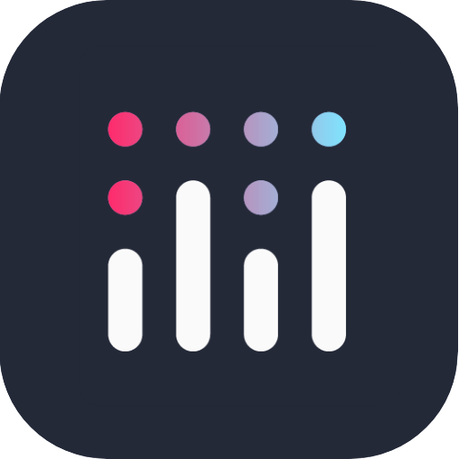

### Bancos de dados

  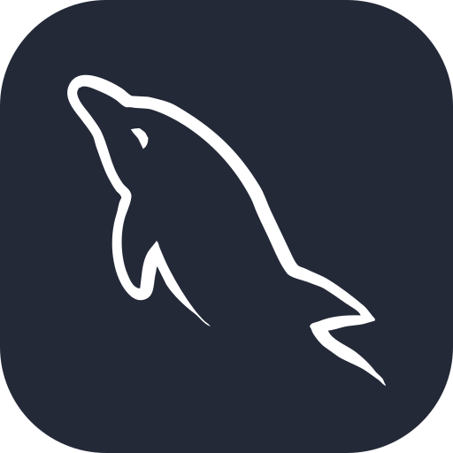
  &nbsp;&nbsp;
  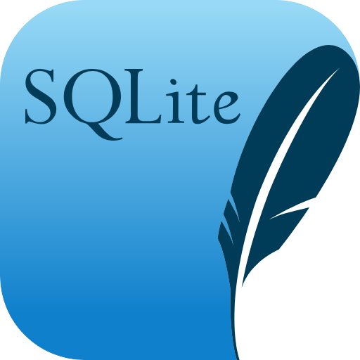

### Versionamento e deploy

  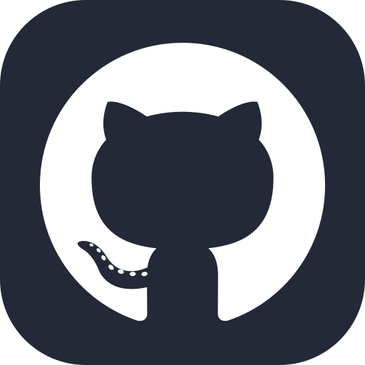
  &nbsp;&nbsp;
  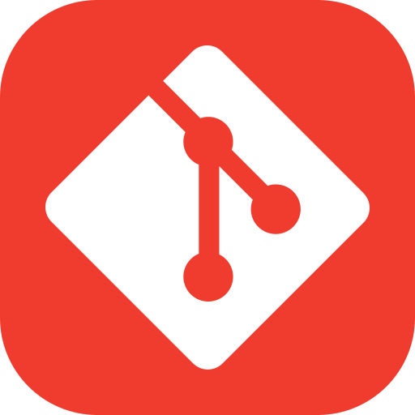
  &nbsp;&nbsp;
  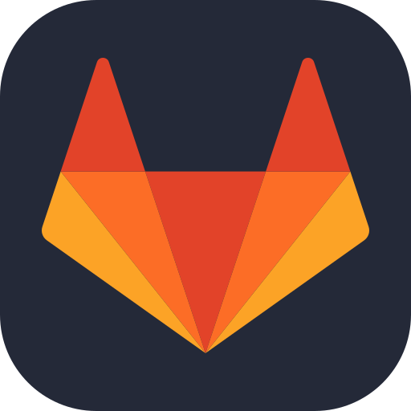
  &nbsp;&nbsp;
  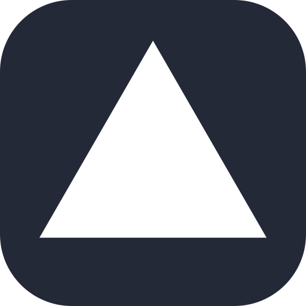

---

## 🌐 Contatos e portfólio

  
  &nbsp;&nbsp;
  
  &nbsp;&nbsp;
  
  &nbsp;&nbsp;
  

